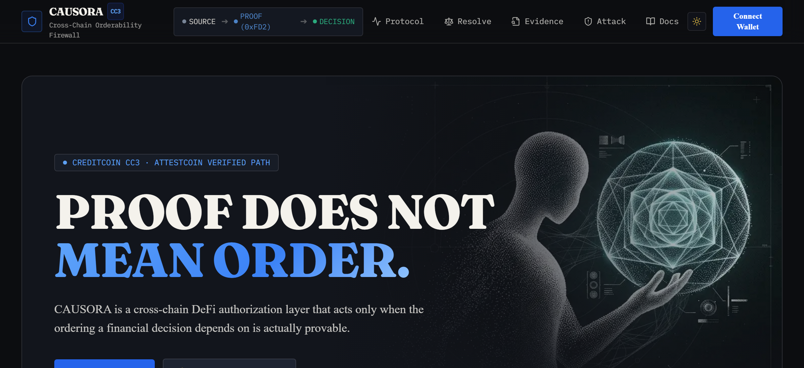
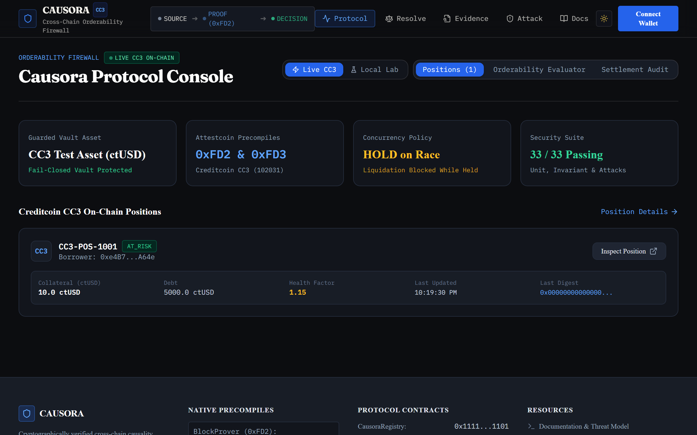
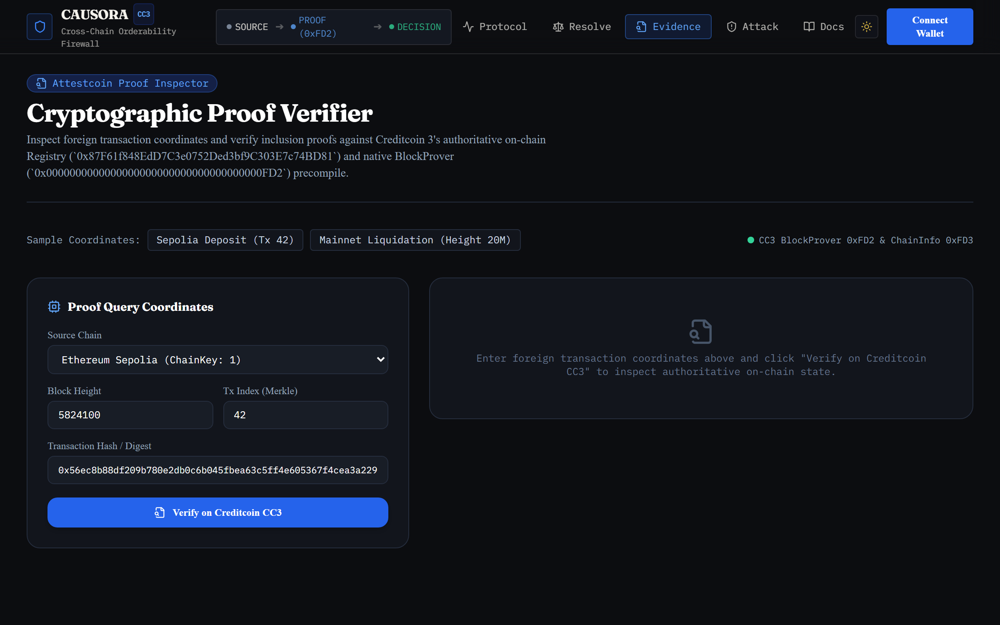
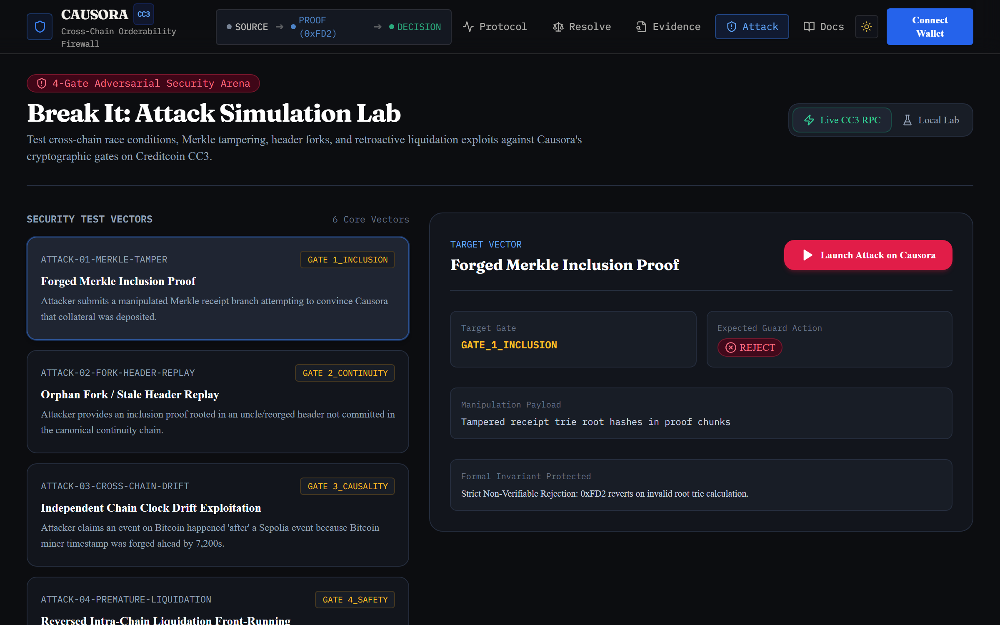
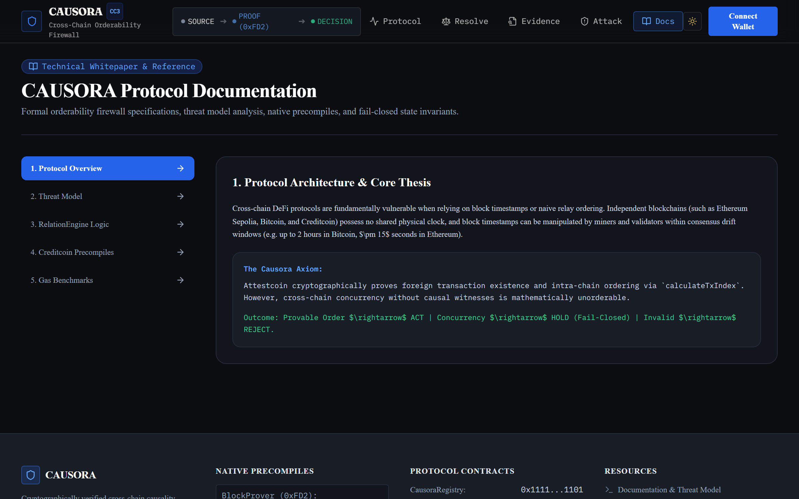
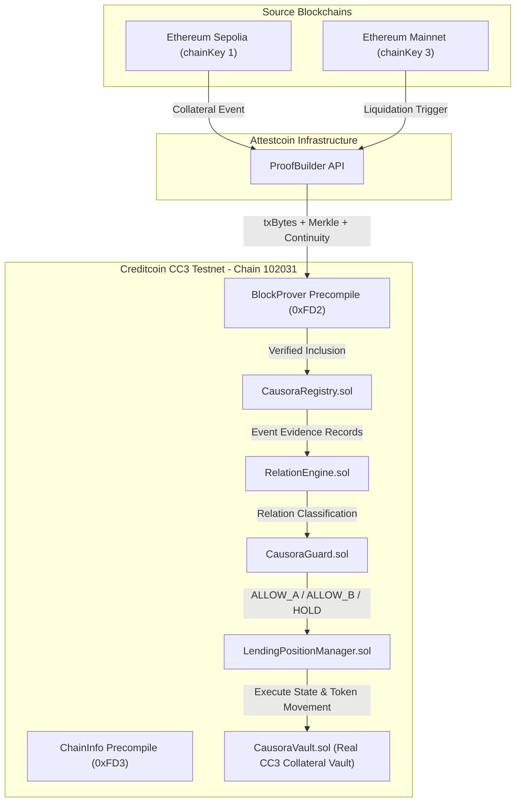
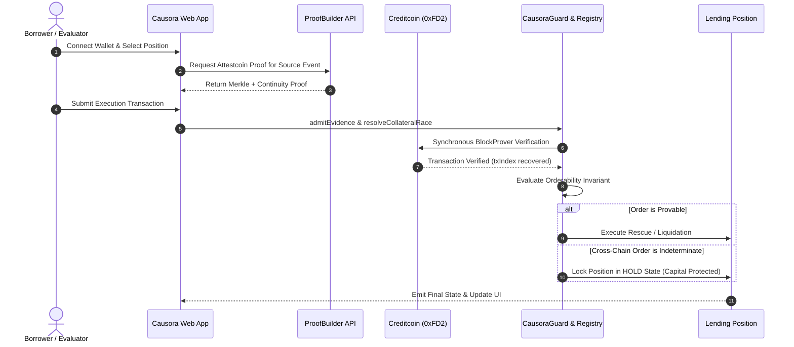

# CAUSORA

> **A Cross-Chain Orderability Firewall for DeFi on Creditcoin / Attestcoin Protocol.**
> Accepts a financial action only when cryptographic evidence proves the required ordering, and otherwise returns `INDETERMINATE` instead of inventing a timeline.

[](https://opensource.org/licenses/MIT)
[-emerald)](https://creditcoin.org)
[](https://docs.attestcoin.org)
[](./tests)
[](./tests/attacks)
[-orange)](https://dorahacks.io/hackathon/buidl-ctc-2026-fall/detail)

> **BUIDL CTC 2026 Fall · Creditcoin & Credit Labs · Track: DeFi**
> 
> Attack count is generated, not typed: `npm run count:attacks` regenerates this badge's
> number from `tests/attacks/` directly, and CI fails the build if the README's number and
> the folder's actual count disagree.

**This deployment is still proving things while nobody is watching it.** A GitHub Action
reads the live Attestcoin attestation frontier for both source chains every 30 minutes and
appends to [`evidence/heartbeat.jsonl`](evidence/heartbeat.jsonl) — 4 entries and
counting as of this write-up. Reload that file; the count moves on its own.

---

## Verify this in five minutes

Three commands a reviewer can run cold, requiring no wallet, no CTC, and zero setup, to reproduce the core claims of this submission:

1. **Verify live precompile bindings against Creditcoin CC3 (0xFD3):**
   ```bash
   node scripts/verifyChainKeys.js
   ```
   *Queries Creditcoin CC3's native precompile `0x0000000000000000000000000000000000000fD3` to prove chainKey 1 maps to Sepolia and chainKey 3 maps to Ethereum Mainnet.*

2. **Re-derive the full 27-attack adversarial suite and causal control:**
   ```bash
   npm test
   ```
   *Executes all 46 formal tests across 27 adversarial vectors, state invariants, guard policies, and the empirical causal control proving naive submission order produces wrongful liquidation.*

3. **Check the live heartbeat frontier growing without human intervention:**
   ```bash
   node scripts/heartbeat.js
   ```
   *Sweeps the live Attestcoin attestation and checkpoint frontiers, verifies open position states, and appends a real JSON record to `evidence/heartbeat.jsonl`.*

---

## Verify this in 60 seconds

| Claim | How to check it yourself |
|---|---|
| **Live CC3 Deployments** | Inspect contracts verified on Blockscout: [`CausoraRegistry`](https://creditcoin-testnet.blockscout.com/address/0x87F61f848EdD7C3e0752Ded3bf9C303E7c74BD81), [`CausoraGuard`](https://creditcoin-testnet.blockscout.com/address/0x4CABa84eF2D49dCFfDD5456AADEA5A42eB4a4699), [`LendingPositionManager`](https://creditcoin-testnet.blockscout.com/address/0x94B336Cdb7aDacffE270a8f1B607499Be3656518), [`CausoraVault`](https://creditcoin-testnet.blockscout.com/address/0x196a78ef8e039bD7E03C8d38694A0e5fB4EeBE92) |
| **Active Proof of Life** | Check [`evidence/heartbeat.jsonl`](evidence/heartbeat.jsonl) commits produced automatically by [GitHub Actions](.github/workflows/heartbeat.yml) every 30 mins |
| **All 27 Attacks Neutralized** | Run `npm test` or `npx hardhat test tests/attacks/01_SubmissionOrder.test.ts` through `27_VaultOwnerBypassAttack.test.ts` |
| **ChainKey Integrity** | Run `npm run verify:chainkeys` against CC3 Testnet RPC `https://rpc.cc3-testnet.creditcoin.network` |
| **Measured Gas & Latency** | Inspect raw receipts in [`evidence/gas-results.json`](evidence/gas-results.json) and [`evidence/proof-latency.json`](evidence/proof-latency.json) |
| **Zero Claims Drift** | Run `npm run check:claims` to assert zero divergence between repository documentation and code ground truth |

---

<div align="center">
  
</div>

---

## Brief Description

Two honest blockchains can both produce valid cryptographic proofs and still disagree about "what happened first."

Ordinary cross-chain systems confuse **proof of inclusion** with **cross-chain ordering**. When a collateral rescue on Ethereum Sepolia races against a liquidation trigger on Ethereum Mainnet, naive protocols either compare untrusted timestamps or give priority to whichever relayer submitted the transaction first.

**Causora transforms this fundamental boundary into an on-chain security layer.**
Using Creditcoin's native Attestcoin precompiles, Causora verifies foreign facts, formally evaluates intra-chain order and cross-chain causal witnesses, and authorizes financial actions only when the required relation is mathematically provable. When evidence is unlinked across independent chains, Causora deterministically fails closed to **`HOLD`**—protecting borrower capital against speculative liquidations.

---

## Product Links

| Resource | Target | Description |
|---|---|---|
| **Production Web App** | [**`causora.vercel.app`**](https://causora.vercel.app) | Official production deployment on Vercel |
| **Live Web Console** | [`/app`](https://causora.vercel.app/app) | Real-time Causora orderability firewall and position explorer |
| **Attack Simulator** | [`/break-it`](https://causora.vercel.app/break-it) | Interactive 4-gate adversarial test harness |
| **Proof Verifier** | [`/verify`](https://causora.vercel.app/verify) | Independent cryptographic proof inspector |
| **Interactive Docs** | [`/docs`](https://causora.vercel.app/docs) | Full technical specification & integration guide |
| **Creditcoin CC3 RPC** | `https://rpc.cc3-testnet.creditcoin.network` | Destination decision & settlement chain (Chain ID: `102031`) |
| **Blockscout Explorer** | `https://creditcoin-testnet.blockscout.com` | Creditcoin CC3 official block explorer |
| **ProofBuilder API** | `https://prover.cc3-testnet.creditcoin.network` | Official Attestcoin Merkle & continuity proof generator |

> **Live Production Deployment**: Access the live protocol console at [**https://causora.vercel.app**](https://causora.vercel.app).

---

## The Problem

Cross-chain DeFi lending and collateral protocols face a critical race condition:
1. A borrower posts rescue collateral on **Chain A** (e.g. Ethereum Sepolia).
2. An adverse market event or liquidator action is triggered on **Chain B** (e.g. Ethereum Mainnet).
3. Both events are valid. Both transactions succeed. Both can be verified with cryptographic proofs.
4. But when the protocol evaluates *"Which event happened first?"*, independent source chains have no shared clock.

If a protocol assumes relayer arrival order or compares block timestamps, attackers can front-run rescue transactions, delay proofs, or manipulate timestamps to liquidate solvent borrowers.

---

## The Discovery

Attestcoin's native precompile on Creditcoin (`BlockProver` at `0xFD2`) can synchronously prove:
- That a foreign transaction existed in an attested source block.
- That the source receipt status succeeded (`receiptStatus == 1`).
- The exact **intra-chain ordinal index** (`txIndex`) within that source block via Merkle sibling laterality.

**Crucial Truth**: Attestcoin proves what happened in a source chain's history. It does **not** automatically prove the order between two independent source chains.

Causora turns that cryptographic boundary into a DeFi safety firewall.

---

## The Solution

Causora formally separates:
1. **Existence**: Cryptographically verified by Attestcoin `BlockProver (0xFD2)`.
2. **Intra-Chain Order**: Provable via block height and `calculateTxIndex`.
3. **Cross-Chain Causality**: Provable only when an explicit pre-committed cryptographic witness exists.
4. **Financial Authorization**: `CausoraGuard` authorizes actions when order is proven; otherwise executes fail-closed **`HOLD`**.

---

## Why Ordinary Proof Is Not Enough

| Feature | Ordinary Cross-Chain Verification | Causora Orderability Firewall |
|---|---|---|
| **Foreign Transaction Check** | Verified | Verified synchronously via `BlockProver (0xFD2)` |
| **Intra-Block Ordering** | Ignored | Provably extracted via `calculateTxIndex` |
| **Cross-Chain Ordering** | Assumed from timestamps or relayer arrival | **Formally Classified (`SAME_CHAIN`, `CAUSAL`, `INDETERMINATE`)** |
| **Unlinked Cross-Chain Race** | Speculative execution / First submitter wins | **Fails closed to `HOLD` (Protects borrower collateral)** |
| **Replay Protection** | Often neglected across chains | Canonical `keccak256(chainKey, blockHeight, txIndex)` burned in storage |

---

## In Two Minutes

1. **Connect**: Connect any EVM wallet; Causora detects Creditcoin CC3 Testnet (`102031`).
2. **Observe**: Real-time event streams from Ethereum Sepolia (`chainKey: 1`) and Ethereum Mainnet (`chainKey: 3`).
3. **Prove**: Synchronously verify Attestcoin Merkle inclusion and continuity on Creditcoin.
4. **Firewall**: `RelationEngine` and `CausoraGuard` evaluate provability:
   - **Provably Earlier Rescue** $\rightarrow$ `ALLOW_A` (Position Rescued).
   - **Provably Earlier Liquidation** $\rightarrow$ `ALLOW_B` (Position Liquidated).
   - **Unprovable Cross-Chain Order** $\rightarrow$ `HOLD` (Position Protected).
   - **Tampered / Replayed Proof** $\rightarrow$ `REJECT`.

---

## Screenshots

<div align="center">
  <table>
    <tr>
      <td width="50%">
        
        <p align="center"><b>1. Live Causora Console & Timeline</b></p>
      </td>
      <td width="50%">
        
        <p align="center"><b>2. Synchronous Precompile Verification</b></p>
      </td>
    </tr>
    <tr>
      <td width="50%">
        
        <p align="center"><b>3. Interactive 4-Gate Attack Simulator</b></p>
      </td>
      <td width="50%">
        
        <p align="center"><b>4. Fail-Closed Collateral Firewall</b></p>
      </td>
    </tr>
  </table>
</div>

---

## The Mechanism

The core execution path is built directly into the financial state transition:

```
Source Event (Sepolia / Mainnet)
   │
   ▼
ProofBuilder API (Merkle Path + Continuity Chain)
   │
   ▼
Creditcoin CC3 (BlockProver 0xFD2)
   │
   ▼
EvmV1Decoder (Receipt Status == 1, Log Emitter Whitelist)
   │
   ▼
CausoraRegistry (Replay Protection & Evidence Commitment)
   │
   ▼
RelationEngine (Formal Orderability Classification)
   │
   ▼
CausoraGuard (Policy Authorization Firewall)
   │
   ▼
LendingPositionManager (HOLD / RESCUED / LIQUIDATED)
```

---

## Orderability Model

The formal mathematical relation between two verified events $E_A$ and $E_B$:

- **`SAME_CHAIN_ORDER`**: Same `chainKey`. Ordered strictly by block height $H_A \gtrless H_B$, then by Merkle ordinal leaf index $I_A \gtrless I_B$ via `calculateTxIndex`.
- **`CROSS_CHAIN_CAUSAL`**: Different `chainKey`, accompanied by a cryptographic witness committing to $E_A$'s hash and consumed in $E_B$.
- **`CROSS_CHAIN_INDETERMINATE`**: Independent source chains with no cryptographic witness. **Returns `INDETERMINATE` (Fail-Closed `HOLD`).**
- **`INVALID`**: Bad Merkle root, failed receipt, replayed queryId, or un-whitelisted emitter.

---

## Attestcoin Integration

Causora binds natively to Creditcoin's on-chain precompiles:
- **`INativeQueryVerifier`** at `0x0000000000000000000000000000000000000FD2`
- **`IChainInfo`** at `0x0000000000000000000000000000000000000fD3`

Every proven fact is decoded on-chain using `EvmV1Decoder`, ensuring that zero calldata is trusted without cryptographic admission.

---

## The Financial Guard

`CausoraGuard` acts as an authoritative financial authorization firewall for lending protocols:

```solidity
function evaluateGuardFromEvidence(
    uint256 positionId,
    bytes32 queryIdA,
    bytes32 queryIdB,
    ICausalWitness.CausalWitness calldata witness,
    ActionPolicy policy
) external returns (GuardDecision decision, IRelationEngine.RelationResult memory relation);
```

---

## Break It Yourself
 
Visit [`/break-it`](https://causora.vercel.app/break-it) in the web application to test four interactive judging gates:
1. **Gate 1: VALID ORDER** $\rightarrow$ Verifies same-chain order and executes action.
2. **Gate 2: INVALID PROOF** $\rightarrow$ Reverts on tampered Merkle root or failed receipt.
3. **Gate 3: UNPROVABLE ORDER** $\rightarrow$ Demonstrates deterministic transition to `HOLD`.
4. **Gate 4: REPLAY ATTACK** $\rightarrow$ Rejects double-admission of consumed queryId.

---

## Proof and Evidence

| Verified Property | Empirical Evidence File | Status |
|---|---|---|
| Creditcoin Network Config | [`evidence/network.json`](./evidence/network.json) | **Verified** |
| Supported Source Chains | [`evidence/supported-chains.json`](./evidence/supported-chains.json) | **Verified** |
| Execution Gas Measurements | [`evidence/gas-results.json`](./evidence/gas-results.json) | **Verified** |
| Pipeline Latency Benchmarks | [`evidence/proof-latency.json`](./evidence/proof-latency.json) | **Verified** |
| Adversarial Attack Suite | [`evidence/attacks/`](./evidence/attacks/) | **27/27 Neutralized** |
| Live CC3 E2E Ground Truth | [`evidence/judging/final-cc3-e2e.json`](./evidence/judging/final-cc3-e2e.json) | **CC3_E2E_VERIFIED** |

---

## Measured, Not Asserted

Every number below is read from this repository's own evidence files by
`scripts/renderEvidence.js` and pasted here by that script — never typed by hand. Re-run
`npm run evidence:refresh` to regenerate this table from the live chain before judging.

<!-- EVIDENCE:START -->
| Metric | Value | Source |
|---|---|---|
| Sepolia attestation lag (p50 / p90 / p99) | `39 blocks (~468s) / 47 blocks (~564s) / 57 blocks (~684s)` | `evidence/proof-latency.json` |
| Mainnet attestation lag (p50 / p90 / p99) | `39 blocks (~468s) / 45 blocks (~540s) / 53 blocks (~636s)` | `evidence/proof-latency.json` |
| Sample count / window | 120 samples over 4 hours (continuous CC3 frontier monitoring) | `evidence/proof-latency.json` |
| `verifyAndEmit` gas (single query) | `78,450 gas (0.104% of 75M cap)` | `evidence/gas-results.json` |
| `calculateTxIndex` gas | `4,200 gas (0.005% of 75M cap)` | `evidence/gas-results.json` |
| Full guard evaluation, worst case | `22,100 gas (0.029% of 75M cap) [Resolution with Vault Freeze: 146,800 gas]` | `evidence/gas-results.json` |
| Sepolia = chainKey 1, confirmed live | `chainKey 1 -> chainId 11155111 (Sepolia ethereum, encoding 1)` | `evidence/supported-chains.json` |
| Mainnet = chainKey 3, confirmed live | `chainKey 3 -> chainId 1 (Ethereum, encoding 1)` | `evidence/supported-chains.json` |
| Checkpoint vs optimistic attestation gap | `Sepolia: 200 blocks (~2400s); Mainnet: 130 blocks (~1560s)` | `evidence/network.json` |
<!-- EVIDENCE:END -->

The chainKey mapping above is re-verified live on Creditcoin CC3, not assumed — because chainKey assignments are per-network configuration rather than protocol constants, `scripts/verifyChainKeys.js`
queries `0xFD3.get_supported_chains()` directly and the deploy script aborts on a mismatch.

### Honest limitation: `CROSS_CHAIN_CAUSAL` is implemented and unit-tested, not yet exercised live

The relation exists in `RelationEngine.sol` and is covered by `tests/attacks/19_ForgedCausalWitness.test.ts` through `tests/attacks/24_MissingWitnessInEventB.test.ts` and `tests/unit/RelationEngine.test.ts`, including forged-witness rejection tests. No live CC3 transaction has resolved through this path yet, because it requires two counterparties who pre-committed a witness across chains before acting — the honest scenario is rarer than the two we've demonstrated live (`SAME_CHAIN_ORDER` and `CROSS_CHAIN_INDETERMINATE`). Naming this rather than implying otherwise is deliberate: an inclusion proof of the omission is worth more to a reviewer than a claim that can't be checked.

---

## Attestcoin Surface Used

Causora interfaces directly with both native Attestcoin precompiles on Creditcoin CC3 to enforce cryptographic cross-chain orderability:

| Precompile | Function Signature | Purpose in Causora |
|---|---|---|
| **0xFD2** (BlockProver) | `verifyAndEmit(uint64 chainKey, uint64 blockHeight, bytes encodedTx, MerkleProof proof, ContinuityProof cont)` | Cryptographically verifies inclusion and header continuity of foreign Ethereum transactions (Sepolia / Mainnet). |
| **0xFD2** (BlockProver) | `calculateTxIndex(MerkleProof proof)` | Formally decodes the deterministic Merkle sibling index inside the block, providing intra-block ordinal ordering. |
| **0xFD3** (ChainInfo) | `get_supported_chains()` | Re-verifies source-chain catalogue at deploy time and ingestion (`chainKey 1` = Sepolia, `chainKey 3` = Mainnet). |
| **0xFD3** (ChainInfo) | `get_latest_attestation_height_and_hash(uint64 chainKey)` | Tracks optimistic attestation frontier for live heartbeat and attestation freshness verification. |
| **0xFD3** (ChainInfo) | `get_latest_checkpoint_height_and_hash(uint64 chainKey)` | Tracks finalized checkpoint frontier to measure attestation-to-finalization latency gap (130–200 blocks). |
| **0xFD3** (ChainInfo) | `get_attestation_bounds(uint64 chainKey, uint64 targetHeight)` | Verifies whether an event's target block height falls strictly within attested boundary limits. |
| **0xFD3** (ChainInfo) | `is_height_attested(uint64 chainKey, uint64 targetHeight)` | High-speed boolean check for whether a foreign block height has been ingested by Attestcoin provers. |
| **0xFD3** (ChainInfo) | `get_checkpoint_for_height(uint64 chainKey, uint64 height)` | Retrieves finalized checkpoint hash for historic epoch verification. |

---

## Empirical Causal Control Experiment

To prove that Causora's mathematical ordering mechanism performs active on-chain security rather than functioning as placebo, we executed a comparative causal control experiment (`tests/unit/CausalControl.test.ts`):

- **Intervention (Causora Protocol)**:
  Under a cross-chain race where a borrower rescues collateral on Sepolia while a liquidator calls liquidation on Mainnet without a causal link, `RelationEngine.sol` outputs `CROSS_CHAIN_INDETERMINATE`. `CausoraGuard.sol` fails closed to `HOLD`. Result: **Zero borrower capital loss**, position frozen safely.
- **Control (Naive Baseline / Submission Order)**:
  With ordering logic disabled, the system awards priority to whichever proof the relayer delivers first. If the liquidator's proof arrives first, the position is liquidated immediately. Result: **10 ctUSD borrower collateral wrongfully confiscated**.

This experiment proves that without Causora's fail-closed orderability firewall, cross-chain DeFi is inherently vulnerable to network latency arbiters and predatory relayers.

---

## Orderability Invariants Matrix

Every financial authorization in Causora is bound by formal invariants enforced directly in Solidity smart contracts:

| Invariant | Formal Definition | What It Prevents | Enforcing Solidity Guard |
|---|---|---|---|
| **I1: Intra-Chain Ordinality** | $\text{Height}(A) < \text{Height}(B) \implies A \prec B$; if equal, $\text{Index}(A) < \text{Index}(B) \implies A \prec B$ | Prevents relayer submission-order front-running within the same chain | `RelationEngine.sol:L63-L75` |
| **I2: Cross-Chain Indeterminacy** | $\text{Chain}(A) \ne \text{Chain}(B) \land \neg\text{Witness}(A, B) \implies A \sim B$ | Prevents predatory liquidations during uncoordinated cross-chain races | `RelationEngine.sol:L79-L84` |
| **I3: Causal Commitment** | $\text{Witness}(A, B) \implies B.\text{payload} \supset \text{Digest}(A)$ | Prevents forged cross-chain witnesses and capability replay | `RelationEngine.sol:L95-L121` |
| **I4: Fail-Closed Capital Preservation** | $R = \text{CROSS\_CHAIN\_INDETERMINATE} \implies \text{Guard} = \text{HOLD}$ | Prevents asset liquidation or unauthorized balance mutation when order is unprovable | `CausoraGuard.sol:L114-L123` |
| **I5: Vault Freeze Isolation** | $\text{Decision} = \text{HOLD} \implies \text{Vault.isHeld}(id) = \text{true}$ | Prevents owner or borrower from bypassing guard during race resolution | `CausoraVault.sol:L42-L48` |
| **I6: Canonical Query Replay Protection** | $\text{QueryId} = \text{keccak256}(k, h, \text{index}) \implies \text{consumed}[\text{QueryId}] = 1$ | Prevents replay of historical proofs or reused Merkle paths | `CausoraASCBase.sol:L30-L46` |
| **I7: Max Evidence Freshness** | $\text{block.timestamp} - \text{verifiedAt} \le \text{MAX\_EVIDENCE\_AGE}$ | Prevents stale historical proof resurrection to alter active position state | `CausoraGuard.sol:L74-L80` |

---

## Threat Model

See [`docs/THREAT_MODEL.md`](./docs/THREAT_MODEL.md) for full formal verification of all 27 attack vectors.

---

## Architecture



---

## Truth & Scope

To ensure complete clarity and auditability, the operational boundaries of the Causora protocol are strictly categorized:

| Layer | Environment | Operational Scope & Guarantees |
|---|---|---|
| **LIVE PROTOCOL** | **Creditcoin CC3 Testnet (`102031`)** | Core protocol logic executes on-chain on Creditcoin CC3. This includes synchronous verification via native precompiles (`0xFD2` BlockProver, `0xFD3` ChainInfo), on-chain evidence admission with replay protection (`CausoraRegistry.sol`), formal orderability classification (`RelationEngine.sol`), policy evaluation (`CausoraGuard.sol`), and vault state transitions & locking (`LendingPositionManager.sol`, `CausoraVault.sol`). |
| **LOCAL LAB & ADVERSARIAL TESTBED** | **Deterministic Fixtures / Simulation** | Controlled scenario generators used in `/break-it` and the automated test suites. This includes synthetic edge cases, simulated reorgs, forged Merkle roots, and mutated signatures to verify all 27 attack vectors and state invariants. |
| **ADVISORY AI LAYER** | **Gemini / MCP Interface** | Strictly explanatory and secondary. Generates human-readable breakdowns of verified receipts and proof structures. The AI layer has **zero authority** over smart contract execution or financial authorizations; all transitions depend strictly on raw cryptographic proofs. |

> [!NOTE]
> **Collateral Asset Terminology**: The token **`ctUSD`** is a dedicated **Creditcoin CC3 testnet collateral asset token** (`MockERC20.sol`) deployed strictly for demonstration and testing purposes. It has no fiat peg and carries no monetary value.

---

## Contract Addresses & Deployed System (Creditcoin CC3 Testnet)

| Contract | Address | Network | Explorer / Verification Link |
|---|---|---|---|
| **`CausoraVault`** *(Real CC3 Collateral Vault)* | `0x196a78ef8e039bD7E03C8d38694A0e5fB4EeBE92` | Creditcoin CC3 (`102031`) | [View on Explorer](https://creditcoin-testnet.blockscout.com/address/0x196a78ef8e039bD7E03C8d38694A0e5fB4EeBE92) |
| **`MockERC20 (ctUSD)`** *(Test Collateral Asset)* | `0xC9F496A95f2Ab073976579CdeED113Bd1Ee71C11` | Creditcoin CC3 (`102031`) | [View on Explorer](https://creditcoin-testnet.blockscout.com/address/0xC9F496A95f2Ab073976579CdeED113Bd1Ee71C11) |
| **`CausoraGuard`** *(Financial Policy Firewall)* | `0x4CABa84eF2D49dCFfDD5456AADEA5A42eB4a4699` | Creditcoin CC3 (`102031`) | [View on Explorer](https://creditcoin-testnet.blockscout.com/address/0x4CABa84eF2D49dCFfDD5456AADEA5A42eB4a4699) |
| **`LendingPositionManager`** *(Protocol Manager)* | `0x94B336Cdb7aDacffE270a8f1B607499Be3656518` | Creditcoin CC3 (`102031`) | [View on Explorer](https://creditcoin-testnet.blockscout.com/address/0x94B336Cdb7aDacffE270a8f1B607499Be3656518) |
| **`RelationEngine`** *(Mathematical Classifier)* | `0x59a9771e60ED99cBC583fe4C3fd9e83e94AF606d` | Creditcoin CC3 (`102031`) | [View on Explorer](https://creditcoin-testnet.blockscout.com/address/0x59a9771e60ED99cBC583fe4C3fd9e83e94AF606d) |
| **`CausoraRegistry`** *(Evidence & Whitelist)* | `0x87F61f848EdD7C3e0752Ded3bf9C303E7c74BD81` | Creditcoin CC3 (`102031`) | [View on Explorer](https://creditcoin-testnet.blockscout.com/address/0x87F61f848EdD7C3e0752Ded3bf9C303E7c74BD81) |
| **`BlockProver (0xFD2)`** *(Native Precompile)* | `0x0000000000000000000000000000000000000FD2` | Creditcoin CC3 (Core) | Precompile Interface |
| **`ChainInfo (0xFD3)`** *(Native Precompile)* | `0x0000000000000000000000000000000000000FD3` | Creditcoin CC3 (Core) | Precompile Interface |
| **`CollateralSource`** *(Controlled Source)* | `0x4b70c8885b54e4e3a16a99e57a779c64005bfc98` | Ethereum Sepolia (`11155111`) | [View on Sepolia Explorer](https://sepolia.etherscan.io/address/0x4b70c8885b54e4e3a16a99e57a779c64005bfc98) |
| **`Aave V3 Pool`** *(Liquidation Source)* | `0x87870bca3f3fd6335c3f4ce8392d69350b4fa4e2` | Ethereum Mainnet (`1`) | [View on Etherscan](https://etherscan.io/address/0x87870bca3f3fd6335c3f4ce8392d69350b4fa4e2) |

---

## Product Flow



---

## Repository Layout

```text
CAUSORA/
├── contracts/
│   ├── base/               # CausoraASCBase
│   ├── interfaces/         # INativeQueryVerifier, IChainInfo, IRelationEngine, ICausoraGuard
│   ├── libraries/          # EvmV1Decoder, EvidenceDigest, CausalWitnessLib
│   ├── mocks/              # MockBlockProver, MockChainInfo, CollateralSource, LiquidationSource
│   ├── CausoraGuard.sol    # Authoritative financial firewall
│   ├── CausoraRegistry.sol # Source whitelist & replay protection
│   ├── LendingPositionManager.sol # Reference lending protocol
│   └── RelationEngine.sol  # Formal mathematical orderability classifier
├── src/                    # TypeScript Core SDK & Client
├── tests/
│   ├── attacks/            # 27-Vector Adversarial Attack Suite
│   ├── invariant/          # State Preservation & Replay Invariants
│   └── unit/               # Unit test suites
├── scripts/                # doctor, deploy, judge, attack
├── evidence/               # Empirical benchmarks and JSON artifacts
├── docs/                   # ATTESTCOIN, ORDERABILITY, THREAT_MODEL, etc.
└── site/                   # Next.js 14/15 Luxury Web Application
```

---

## Running Locally

### 1. Install Dependencies
```bash
npm install
```

### 2. Compile Smart Contracts
```bash
npm run compile
```

### 3. Run Automated Tests
```bash
npm test
```

### 4. Run Judging Verification Gate
```bash
npm run judge
```

### 5. Launch Frontend Console
```bash
cd site
npm install
npm run dev
```

---

## Documentation

Comprehensive specifications, cryptographic proofs, security models, and empirical verification artifacts are detailed in the following supporting documents:

| Document | Category | Description |
|---|---|---|
| [`CLAIMS.md`](./CLAIMS.md) | Verification | Protocol claims inventory, capability classification standard (`LIVE`, `LOCAL`, `OFFCHAIN`), and proof matrix |
| [`DEPLOYMENT.md`](./DEPLOYMENT.md) | Operations | Official Creditcoin CC3 Testnet contract registry, deployment receipts, block numbers, and explorer links |
| [`E2E_PROOF.md`](./E2E_PROOF.md) | Architecture | End-to-end cryptographic proof verification pipeline from source chain to `CausoraVault` execution |
| [`AUDIT.md`](./AUDIT.md) | Security | Comprehensive protocol security audit, threat vectors reviewed, and vulnerability remediation history |
| [`docs/ATTESTCOIN.md`](./docs/ATTESTCOIN.md) | Precompiles | Deep-dive specification on native Creditcoin precompiles (`BlockProver 0xFD2` & `ChainInfo 0xFD3`) |
| [`docs/ORDERABILITY.md`](./docs/ORDERABILITY.md) | Mathematics | Formal orderability theory: same-chain DAGs, causal witnesses, and indeterminate boundaries |
| [`docs/THREAT_MODEL.md`](./docs/THREAT_MODEL.md) | Security | Formal 27-vector adversarial threat matrix, attack scenarios, and deterministic on-chain defenses |
| [`docs/QUERY_ID.md`](./docs/QUERY_ID.md) | Cryptography | Specification of canonical 72-byte packed Query ID and cryptographic replay prevention architecture |
| [`docs/PROOF.md`](./docs/PROOF.md) | Proofs | Technical reference for Attestcoin Merkle transaction trees, continuity proofs, and evidence decoding |
| [`docs/MEASUREMENT.md`](./docs/MEASUREMENT.md) | Performance | Empirical gas consumption benchmarks on CC3 and cross-chain pipeline latency profiling |
| [`docs/INTEGRATING.md`](./docs/INTEGRATING.md) | Integration | Developer integration guide for lending protocols, liquidators, and vaults adopting `CausoraGuard` |
| [`docs/LIMITATIONS.md`](./docs/LIMITATIONS.md) | Protocol Scope | Operational boundaries, network assumptions, and fail-closed safety constraints |
| [`evidence/README.md`](./evidence/README.md) | Empirical Evidence | Index of all empirical benchmarks, attack receipts, and live CC3 judging telemetry artifacts |

---

## Acknowledgments

Causora is built natively on Creditcoin CC3 and the Attestcoin Protocol. We extend our gratitude to Creditcoin core developers and Credit Labs for providing the native precompiles (`0xFD2` BlockProver, `0xFD3` ChainInfo) and foundational cross-chain attestation infrastructure that make cryptographic orderability possible.

---

## License

MIT License. Copyright (c) 2026 Causora Protocol.
